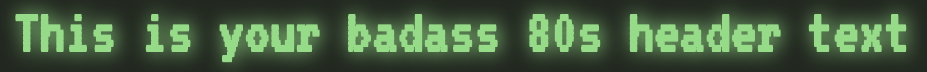
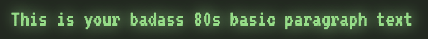
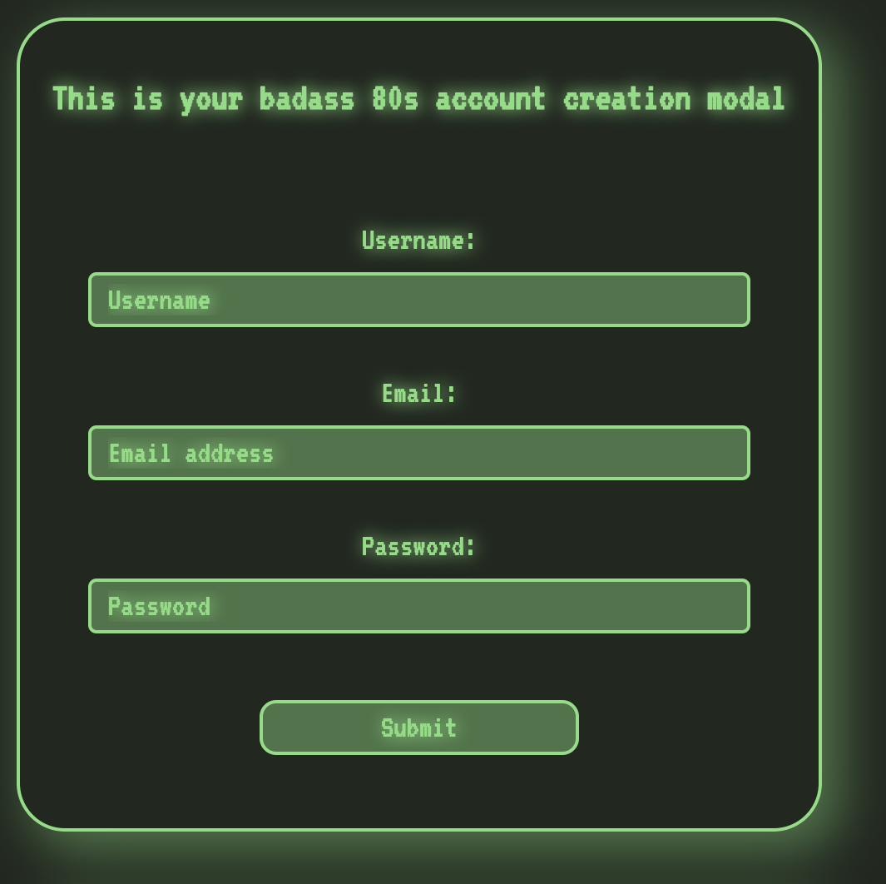
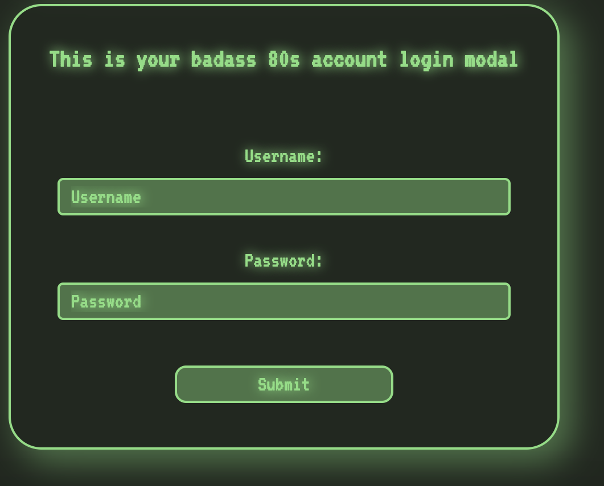

# my-eighties-computer

> Renders four 80s computer styled components to play with...

`My80sH1` is an 80's computer styled h1 element that takes a single prop, which is the text to be displayed.



`My80sPText` is an 80's computer styled paragraph element that takes a single prop, which is the text to be displayed.



`My80sAccCreateModal` is an 80's computer styled account creation modal that is comprised of 3 inputs (username, email, password), and a button. This component takes 2 props, one is the title text to be displayed at the top of the form, and the second is a callback function that will send the current controlled state of the form inputs back to a parent component for use.



`My80sAccLoginModal` takes the same props as `My80sAccCreateModal`. The only difference is that instead of 3 form input fields, it only has 2: 'username', and 'password'; but doesn't include the email field.



[](https://www.npmjs.com/package/my-eighties-computer) [](https://standardjs.com)

## Install

```bash
npm install --save my-eighties-computer
```

## Usage

```jsx
import React, { Component } from 'react'

import My80sAccCreateModal from 'my-eighties-computer'

class Example extends Component {
  render () {
    return (
      <My80sAccCreateModal 
        text='This is your badass 80s account creation modal' 
        onSubmit={content => yourCallbackFunction(content) 
      />
    )
  }
}
```

## License

MIT © [baldm0mma](https://github.com/baldm0mma)
